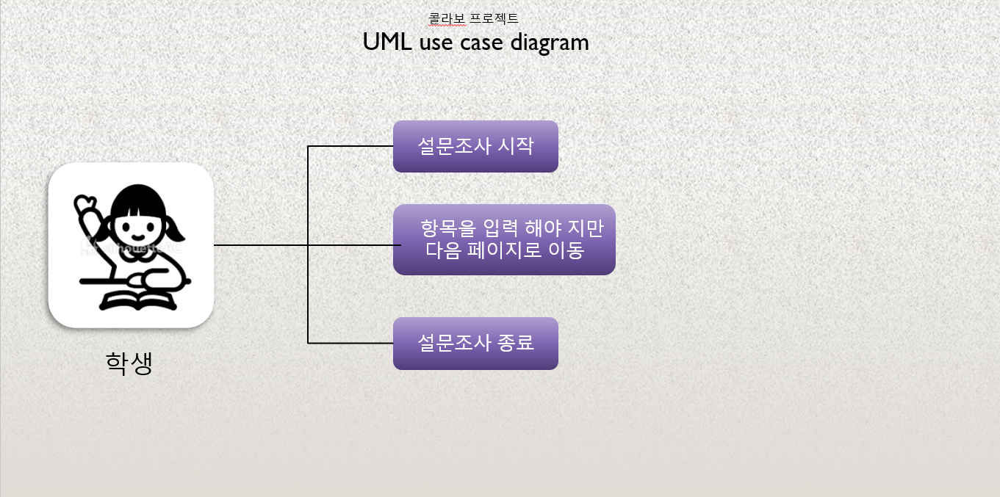

# 개요
● 프로젝트명 : collabo 
● 팀구성 : 유영규

● 목적 : ○ 대학생의 의뢰로 프로젝트 시작 
         ○ 설문조사를 웹사이트로 진행하기 위해 제작
         ○ 고객과 개발자의 관계로 경험을 해보기 위하여
         ○ 포트폴리오 목적으로 제작

● 사용기술 및 개발환경 
    ○ O/S : Windows 10(개발환경)

    ○ Server : Tomcat9

    ○ Pramework : Spring boot, Jquery, Javascript

    ○ Programming Language : JAVA, HTML, Javascript, CSS
    
    ○ Tool : Eclipse

# swiper-project
스와이퍼API를 이용한 설문조사 프로젝트

해당 프로젝트는 Swiper API를 이용한 설문조사 프로젝트 입니다.
설문조사를 진행할때 특정 값을 입력해야지만 다음 페이지로 넘어갈 수 있도록 설계를 하였습니다.

이 프로젝트는 Javascript를 주로 이용하여 진행하였습니다.

# USE-CASE

